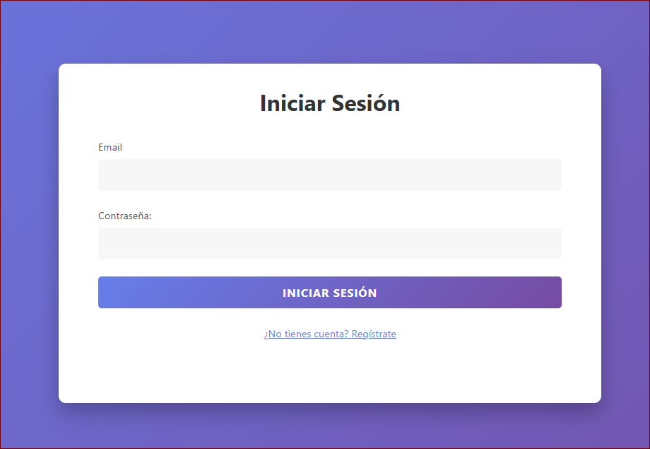
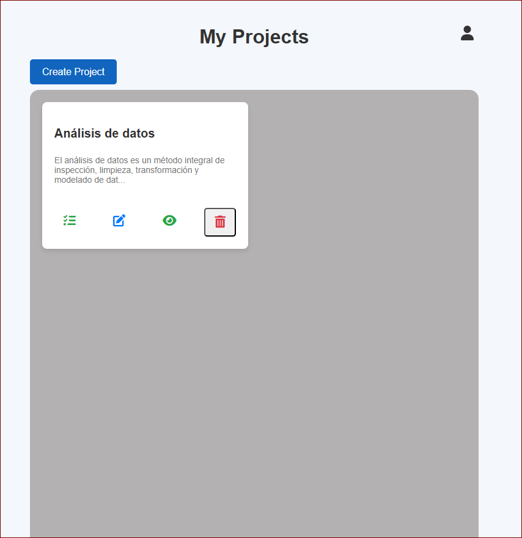
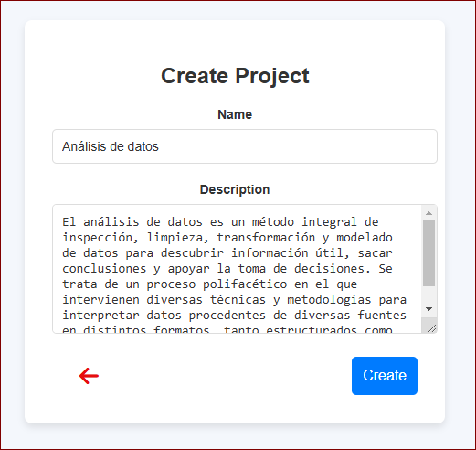
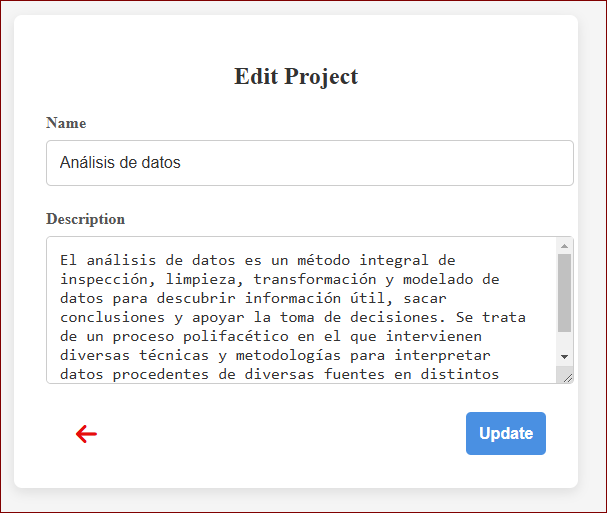
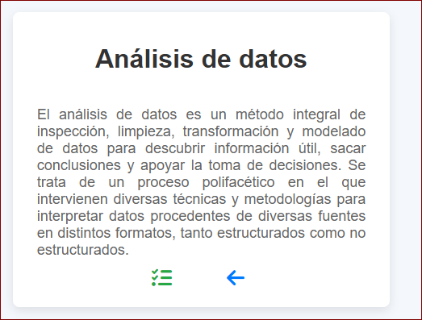
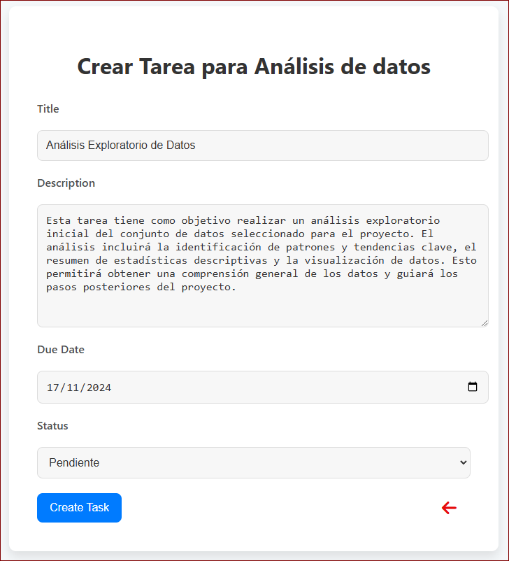
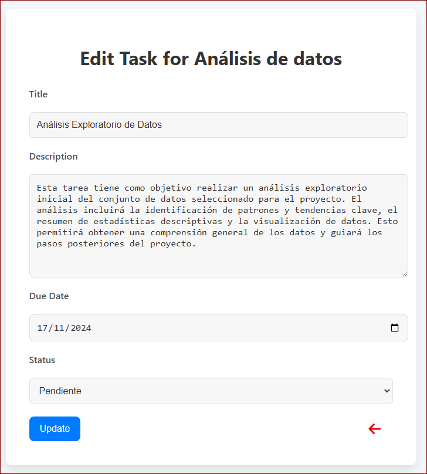
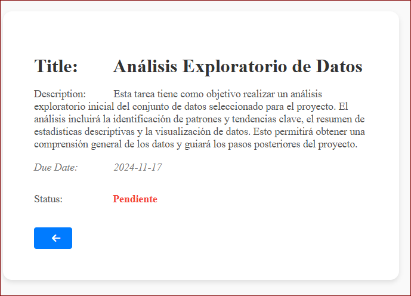

# Proyecto de Autenticación con Laravel

Este proyecto implementa una aplicación web con sistema de autenticación en Laravel. Los usuarios pueden registrarse, iniciar sesión y acceder a una vista de proyectos protegida por autenticación.

## Requisitos

- **PHP** = 8.1
- **Composer**
- **Laravel** = 10
- **MySQL** o cualquier otra base de datos compatible con Laravel

## Capturas de Pantalla

### Página de Inicio de Sesión


### Página de Registro


# Vista de Proyectos (Protegida)

  ### Vista de Proyectos del usuario logeado


  ### Vista de Crear Proyecto


  ### Vista de Editar Proyecto


  ### Vista de un Proyectos Especifico


  ### Vista de Tareas de un Proyecto


  ### Vista de Crear Tarea


  ### Vista de Editar Tarea


  ### Vista de una Tarea especifica


## Instrucciones de Instalación

Sigue estos pasos para configurar el proyecto en tu entorno local.

1. **Clonar el repositorio**

   ```bash
   git clone https://github.com/Rumaldo24/task-manager.git
   cd task-manager

2. **Instalar dependencias de PHP**

   - ejecute `composer install`.

3. **Configurar las variables de entorno**
   
   - copia el archivo `.env.example` a `.env` y ajusta las variables de entorno.
   - Abre el archivo `.env` y configura las variables de base de datos:
       - DB_CONNECTION=mysql
       - DB_HOST=127.0.0.1
       - DB_PORT=3306
       - DB_DATABASE=nombre_base_datos
       - DB_USERNAME=root
       - DB_PASSWORD=
  
4. **Generar clave de la aplicación**
   
   - Ejecute el siguiente comando php `artisan key:generate`
  
5. **Ejecutar migraciones de base de datos**
   
   - Las migraciones crean las tablas necesarias en la base de datos. Ejecuta el siguiente comando para aplicar las migraciones: `php artisan migrate`.
  
6. **Iniciar el servidor de desarrollo**
   
   - Ejecuta el siguiente comando para iniciar el servidor de desarrollo: `php artisan serve`.
   - Luego, abre tu navegador y visita http://127.0.0.1:8000.


## **Uso**

**Registro**

   - En la página de registro, ingresa un nombre, correo electrónico y una contraseña para crear una cuenta.

**Inicio de Sesión**

  - Ingresa las credenciales que usaste al registrarte (correo y contraseña) para acceder a la vista de proyectos.

**Acceso a la Vista de Proyectos**

  - Una vez autenticado, podrás acceder a la vista de proyectos. donde puedes crear, actualizar, eliminar proyectos, asi como agregar, editar, eliminar tareas para cada proyecto.

## 🛡️ Licencia

Este proyecto fue desarrollado por **Rumaldo V. Riquelme** con fines personales y educativos.

### Permisos:
✅ Puedes usar el código como referencia para proyectos personales o educativos  
✅ Puedes modificar y adaptar el código según tus necesidades personales  

### Restricciones:
❌ No puedes redistribuir el código original o modificado como propio  
❌ No puedes eliminar esta nota de licencia ni el crédito al autor  
❌ No puedes usar el código en productos comerciales sin autorización expresa  

Si deseas utilizar este proyecto con otros fines, por favor contáctame:  
📧 rumaldorv.11@outlook.com 